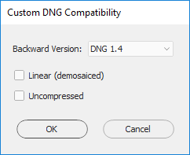
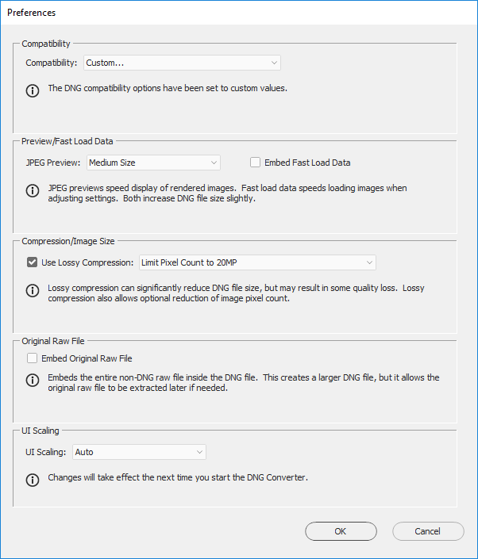

# camera-pipeline GUI

The camera-pipeline GUI was written by [Hakki Can Karaimer](https://karaimer.github.io/), and is described in the [project page](https://karaimer.github.io/camera-pipeline) and [documented here](https://docs.google.com/document/d/1WzeZ-9U4aTuwFpcX-8GgAy0wT9ERF41ltjr-jJ-NMCo/edit) 


# camera-pipeline command-line API

This repository contains (in addition to the GUI) a code wrapper to use the camera-pipline


## DNG Conversion 

Use [Adobe DNG Converter](http://supportdownloads.adobe.com/product.jsp?product=106&platform=Windows) to convert raw images to DNG.

The conversion settings are shown in the screen captures (courtesy of Hakki Can Karaimer).
If the raw files' resolution is over 20MPixel, limit the resolution during the conversion to DNG (the DNG SDK cannot handle large files, on a computer with 32GB memory, Nikon D810 files could not be processed at full resolution). 
 





## Using the API

This repository contains a demo file: `demo_CameraPipelineAPI.m`

Whenever using the API, you should first define the folder where the files in this reposity are saved:

```
SDK_path = <insert the directory of this repository>;
``` 

### Use-case 1: stop the pipeline at stage 4 (after demosaic) and process the linear TIF, then load it back to the pipeline for final conversion

Define the image files:

    input_image = fullfile(SDK_path, 'sample_image', 'NIKOND40_0008_dng_converted.dng');
    intermediate_image = fullfile('.','intermediate.tif');
    output_image = fullfile('.','result.tif');
    correct_vignette = true;

Then run the pipeline until stage 4, insert your own processing and load the image back to the pipeline

    cp = CameraPipelineAPI(SDK_path, correct_vignette);
    cp.ExecutePipeline('begin', cp.STAGE4_DEMOSAIC, input_image, intermediate_image);
    % insert processing code here, process intermediate_image
    cp.ExecutePipeline('cont', cp.FINAL_STAGE, intermediate_image, output_image);

### Use-case 2: Convert a DNG image to TIF

Define the image files:

    input_image = fullfile(SDK_path, 'sample_image', 'NIKOND40_0008_dng_converted.dng');
    output_image = fullfile('.','result.tif');
    correct_vignette = true;

Run the pipeline:

    cp = CameraPipelineAPI(SDK_path, correct_vignette);
    cp.ExecutePipeline('begin', cp.FINAL_STAGE, input_image, output_image);

